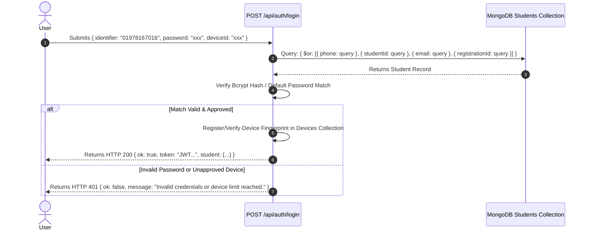
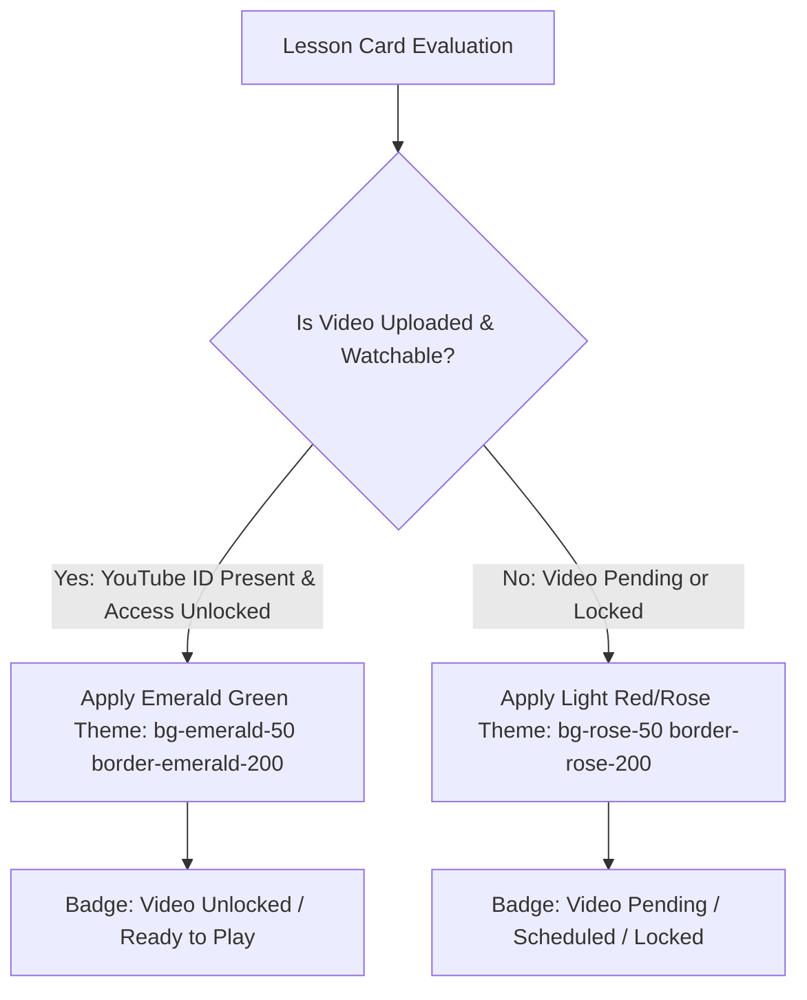

# Master AI Implementation Blueprint: BJS & Bar Aspirants Academy

> [!IMPORTANT]
> **Zero-Prompt Master Specification for AI Agents & Developers**  
> This document contains the complete, self-contained implementation specification, database schemas, API contracts, security algorithms, and directory structures for building/migrating the **BJS and Bar Aspirants Academy** platform. Any AI coding agent can read this single document and construct the entire application end-to-end without requiring further user instructions.

---

## 1. Complete Directory Structure

```
bjs-bar-academy/
├── client/                     # React 18 Single Page Application
│   ├── index.html              # Entry HTML with meta tags & Google Fonts
│   ├── vite.config.js          # Vite build configuration with proxy
│   ├── tailwind.config.js      # Custom theme tokens & glassmorphism utilities
│   ├── src/
│   │   ├── main.jsx            # React root renderer
│   │   ├── App.jsx             # Router & Global Toast Provider
│   │   ├── assets/             # Brand logos & background images
│   │   ├── components/         # Reusable React UI Components
│   │   │   ├── Navbar.jsx      # Top navigation header & user avatar
│   │   │   ├── Footer.jsx      # Portal footer
│   │   │   ├── CourseCard.jsx  # Interactive course card with module accordion
│   │   │   ├── VideoPlayerModal.jsx # Custom YouTube player with dynamic watermark
│   │   │   ├── AiChatDrawer.jsx # Floating Gemini AI Assistant drawer
│   │   │   ├── ProfileModal.jsx # Student account & active access details modal
│   │   │   └── PaymentModal.jsx # bKash Send Money payment submission modal
│   │   ├── pages/              # View Routes
│   │   │   ├── Home.jsx        # Landing page with MCQ exam entry
│   │   │   ├── Login.jsx       # Multi-identifier instant login page
│   │   │   ├── Register.jsx    # Dynamic Batch select dropdown registration form
│   │   │   ├── Dashboard.jsx   # Student portal learning dashboard
│   │   │   └── AdminPanel.jsx  # Admin management & security lock control center
│   │   ├── context/
│   │   │   └── AuthContext.jsx # Auth state, JWT session & active student profile
│   │   └── services/
│   │       └── api.js          # Axios / Fetch client for REST API endpoints
└── server/                     # Node.js Express REST Backend
    ├── server.js               # Main Express app listener
    ├── .env                    # Environment variables (MONGODB_URI, JWT_SECRET, PORT)
    ├── models/                 # Mongoose Data Schemas
    │   ├── Student.js
    │   ├── Course.js
    │   ├── Lesson.js
    │   ├── Enrollment.js
    │   ├── Registration.js
    │   ├── Payment.js
    │   └── Device.js
    ├── routes/                 # API Controllers & Express Routes
    │   ├── authRoutes.js
    │   ├── courseRoutes.js
    │   ├── studentRoutes.js
    │   ├── adminRoutes.js
    │   └── aiRoutes.js
    └── middleware/             # Security & RBAC Guard Middlewares
        ├── authMiddleware.js
        └── deviceGuard.js
```

---

## 2. Complete Mongoose Database Models (Data Layer)

### 2.1 Student Model (`server/models/Student.js`)
```javascript
const mongoose = require("mongoose");

const studentSchema = new mongoose.Schema({
  id: { type: String, required: true, unique: true, index: true }, // e.g. STU-2026-001
  name: { type: String, required: true, trim: true },
  phone: { type: String, required: true, unique: true, index: true }, // e.g. 01978167016
  email: { type: String, required: true, unique: true, index: true }, // e.g. prottoy@gmail.com
  batch: { type: String, default: "Judiciary 2026" },
  session: { type: String, default: "Weekend Intensive" },
  password: { type: String, required: true }, // Hashed bcrypt password
  status: { type: String, enum: ["Active", "Inactive", "Blocked"], default: "Active" },
  loginApproval: { type: String, enum: ["Approved", "Pending", "Preview", "Rejected"], default: "Approved" },
  portalAccessMode: { type: String, default: "" },
  enrolledCourseIds: [{ type: String }],
  completedLessonIds: [{ type: String }],
  maxDeviceCount: { type: Number, default: 2 },
  highlight: { type: String, default: "" },
  joinedOn: { type: String, default: () => new Date().toISOString().split("T")[0] },
}, { timestamps: true });

module.exports = mongoose.model("Student", studentSchema);
```

### 2.2 Course Model (`server/models/Course.js`)
```javascript
const mongoose = require("mongoose");

const courseSchema = new mongoose.Schema({
  id: { type: String, required: true, unique: true, index: true }, // e.g. civil-laws-intensive
  title: { type: String, required: true },
  shortTitle: { type: String, default: "" },
  faculty: { type: String, default: "Senior Law Faculty" },
  category: { type: String, default: "Law Course" },
  schedule: { type: String, default: "Regular Class" },
  nextLive: { type: String, default: "" },
  price: { type: String, default: "1000" },
  description: { type: String, default: "" },
  status: { type: String, enum: ["Active", "Inactive", "Hidden"], default: "Active" },
}, { timestamps: true });

module.exports = mongoose.model("Course", courseSchema);
```

### 2.3 Lesson Model (`server/models/Lesson.js`)
```javascript
const mongoose = require("mongoose");

const lessonSchema = new mongoose.Schema({
  id: { type: String, required: true, unique: true, index: true }, // e.g. les-civil-1
  courseId: { type: String, required: true, index: true },
  module: { type: String, default: "General Classes" },
  title: { type: String, required: true },
  duration: { type: String, default: "45min" },
  youtubeId: { type: String, default: "" }, // Extracted 11-char YouTube ID
  releaseDate: { type: String, default: "" },
  resources: [{ type: String }],
  description: { type: String, default: "" },
}, { timestamps: true });

module.exports = mongoose.model("Lesson", lessonSchema);
```

---

## 3. High-Speed Multi-Identifier Authentication Spec



## 4. Video Availability & Module Color-Coding Engine

To provide instant visual feedback to students regarding video availability, each lesson card and module container dynamically evaluates its video upload status and student access permissions.



### 4.1 Visual Color-Coding Matrix

| Video State | Condition | Background Class | Border Class | Badge Status |
| :--- | :--- | :--- | :--- | :--- |
| **Active & Ready** | `accessState.canWatch && youtubeId` | `bg-emerald-50/40` | `border-emerald-200` | `text-emerald-800` (Unlocked / Play) |
| **Pending / Missing Video** | `!youtubeId` | `bg-rose-50/40` | `border-rose-200` | `text-rose-800` (Video Pending) |
| **Locked Access** | `!accessState.canWatch` | `bg-rose-50/40` | `border-rose-200` | `text-rose-800` (Access Locked) |
| **Completed Lesson** | `student.completedLessonIds.includes(id)` | `bg-emerald-100` | `border-emerald-300` | `text-emerald-900` (Completed) |

---

## 5. Frontend Component Blueprints (React Specs)

### 4.1 Anti-Screen Recording Video Player (`client/src/components/VideoPlayerModal.jsx`)
```jsx
import React, { useEffect } from "react";

export default function VideoPlayerModal({ videoId, title, student, onClose }) {
  useEffect(() => {
    // Disable right-click & DevTools shortcuts
    const preventAction = (e) => {
      if (e.type === "contextmenu" || e.keyCode === 123 || (e.ctrlKey && e.shiftKey && (e.keyCode === 73 || e.keyCode === 74))) {
        e.preventDefault();
      }
    };
    window.addEventListener("contextmenu", preventAction);
    window.addEventListener("keydown", preventAction);
    return () => {
      window.removeEventListener("contextmenu", preventAction);
      window.removeEventListener("keydown", preventAction);
    };
  }, []);

  return (
    <div className="fixed inset-0 z-[9999] flex items-center justify-center bg-black/80 p-4">
      <div className="relative w-full max-w-4xl rounded-2xl bg-slate-900 overflow-hidden shadow-2xl">
        {/* Header */}
        <div className="flex items-center justify-between border-b border-slate-800 p-4 text-white">
          <h3 className="font-bold text-lg">{title}</h3>
          <button onClick={onClose} className="rounded-full bg-slate-800 p-2 text-slate-400 hover:text-white">✕</button>
        </div>

        {/* Video Frame with Floating Watermark Overlay */}
        <div className="relative aspect-video w-full bg-black">
          <iframe
            src={`https://www.youtube.com/embed/${videoId}?autoplay=1&rel=0&modestbranding=1&controls=1`}
            className="h-full w-full border-0"
            allow="autoplay; encrypted-media"
            allowFullScreen
          />
          {/* Dynamic Floating Watermark */}
          <div className="pointer-events-none absolute inset-0 flex items-center justify-center opacity-25 select-none">
            <p className="rotate-[-15deg] font-mono text-sm font-bold text-white tracking-widest text-center">
              {student.name} | {student.phone} | ID: {student.id} <br />
              CONFIDENTIAL - DO NOT RECORD
            </p>
          </div>
        </div>
      </div>
    </div>
  );
}
```

---

## 5. Automated Build Prompt Checklist for AI Agents

Any AI Agent building this repository should execute the following checklist sequentially:

- [x] **Step 1**: Initialize Vite React project in `client/` and Express API server in `server/`.
- [x] **Step 2**: Create Mongoose database models for `Student`, `Course`, `Lesson`, `Enrollment`, `Registration`, `Payment`, and `Device`.
- [x] **Step 3**: Implement Express REST endpoints (`POST /api/login`, `POST /api/register`, `GET /api/courses`, `GET /api/lessons`).
- [x] **Step 4**: Implement dynamic Batch `<select>` dropdown with auto-filling Session dates on the registration page.
- [x] **Step 5**: Build Anti-Screen Recording Video Player with floating dynamic student watermark overlay.
- [x] **Step 6**: Deploy static frontend assets to Netlify CDN with `Cache-Control: no-cache, no-store, must-revalidate`.
