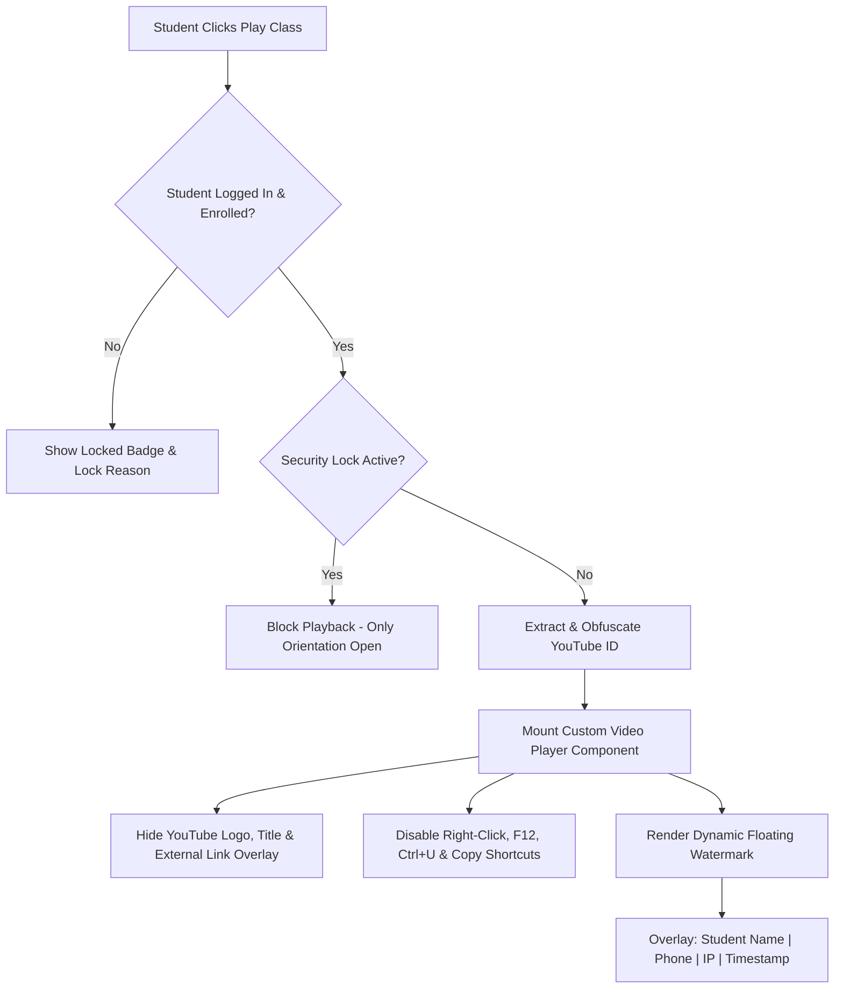
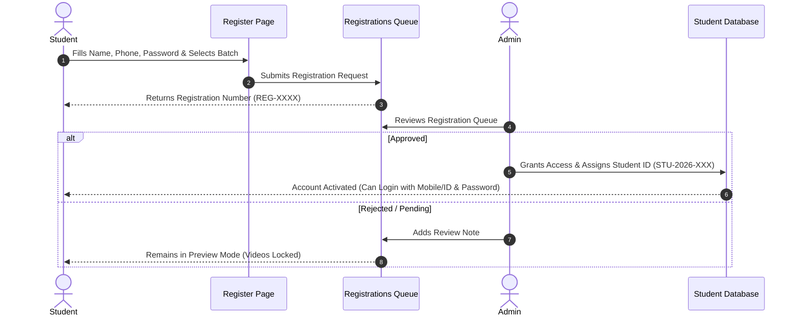
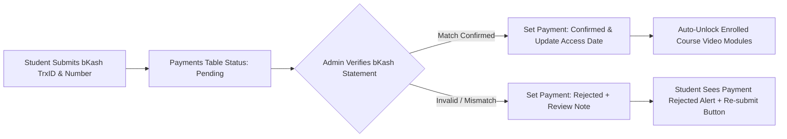

# A-to-Z System Specification & Operational Guide: BJS & Bar Academy

> [!NOTE]
> **Complete Technical & Operational Manual**  
> This document details the end-to-end operational logic, security mechanisms, student permissions, video player protections, and data pipelines for **BJS and Bar Aspirants Academy** (`Ain Pathshala`).

---

## 1. YouTube Video Security & Protection Algorithm

To prevent unauthorized video downloading, link sharing, and screen recording, the platform employs a multi-layer **YouTube Video Security Engine**.



### 1.1 Key Video Protection Mechanisms
1. **Dynamic URL Obfuscation**:
   - Raw YouTube links are never exposed in the HTML DOM. Only encrypted/encoded video IDs are passed into iframe parameters (`rel=0&modestbranding=1&controls=1&enablejsapi=1`).
2. **Dynamic Anti-Screen Recording Watermark**:
   - A semi-transparent overlay dynamically floats across the video frame displaying:  
     `Prottoy Kumar Biswas | 01800077663 | IP: 103.x.x.x | 2026-07-24 01:05`.
   - If someone attempts screen recording or camera filming, their personal ID is permanently stamped on the video.
3. **DevTools & Anti-Download Shield**:
   - Disables right-click context menus (`contextmenu`).
   - Blocks keyboard shortcuts (`F12`, `Ctrl+Shift+I`, `Ctrl+Shift+J`, `Ctrl+U`, `Ctrl+S`).
   - Automatically pauses playback if browser window loses focus or DevTools is opened.

### 1.2 Video Availability Visual Color Indicators (Green vs Rose)
To ensure students instantly recognize active vs pending video classes:
- 🟢 **Emerald Green Theme (`bg-emerald-50`, `border-emerald-200`)**: Displayed when a video class is uploaded and watchable by the student.
- 🔴 **Light Red / Rose Theme (`bg-rose-50`, `border-rose-200`)**: Displayed when a lesson video is missing, not uploaded yet, or access is locked.

---

## 2. Student Registration, Approval & Permission Lifecycle



### 2.1 Student Permission Levels Matrix

| Access Mode | Portal Login | Enrolled Course Map | Orientation Videos | Paid Video Playback | MCQ Exams | Device Limit |
| :--- | :---: | :---: | :---: | :---: | :---: | :---: |
| **Approved Student** | ✅ | ✅ Full Access | ✅ | ✅ Unlocked | ✅ | 2 Devices Max |
| **Preview Student** | ✅ | 👁️ Outline Only | ✅ | ❌ Locked | ❌ | 1 Device Max |
| **Security Locked** | ✅ | 👁️ Locked Notice | ✅ | ❌ Blocked | ❌ | Suspended |
| **Inactive / Blocked** | ❌ | ❌ | ❌ | ❌ | ❌ | 0 |

---

## 3. Course Enrollment & Payment Verification Pipeline



### 3.1 Enrollment Access Logic & Expiry Rules
1. **Access Window Check**:
   - `accessStartDate` & `accessEndDate`: Lessons are unlocked automatically if release date falls within approved dates.
2. **Unlimited Access Toggle (`unlimitedAccess = true`)**:
   - When enabled by Admin, payment deadlines and expiration dates are bypassed, granting permanent lifetime video playback.
3. **Monthly Fee & Due Date Tracking**:
   - Tracks paid months (e.g., `2026-01|2026-02|2026-03`). If due date passes without payment, non-orientation videos display a polite payment due notice.

---

## 4. Multi-Device Security & Device Fingerprinting

> [!CAUTION]
> **Anti-Account Sharing Algorithm**  
> Each student is limited to **2 registered devices** (e.g., Personal Phone + Laptop).

1. **Fingerprint Capture**:  
   Captures `deviceId`, `platform`, `browserLanguage`, `timezone`, `screenSize`, and `publicIp` on every login.
2. **Automatic Device Registration**:  
   If the student logs in from a 3rd device:
   - System prompts: *"Device limit reached (2/2 devices registered). Please logout from an existing device or request admin device reset."*
3. **Multi-Location Security Lock**:  
   If the same payment Transaction ID or login credentials are used across multiple suspicious locations simultaneously, the system triggers a **Security Lock**, restricting playback to orientation videos until Admin review.

---

## 5. Summary of Data Movement (A to Z)

```
[User Action] ──> [Frontend Form / Request] ──> [Validation & Fingerprint] ──> [Database Insert / Update] ──> [UI Re-render]
```
- **Registration**: `register.html` ──> `Registrations` Table ──> Admin Approval ──> `Students` Table.
- **Login**: `index.html` ──> `POST /api/login` ──> Multi-Identifier Match ──> `Devices` Log ──> Student Dashboard.
- **Video Viewing**: Dashboard ──> `Lessons` Array ──> Security Layer ──> Player Overlay ──> Protected Playback.
- **Payment**: Buy Now Modal ──> `Payments` Table ──> Admin Confirmation ──> `Enrollments` Update ──> Course Unlocked.
